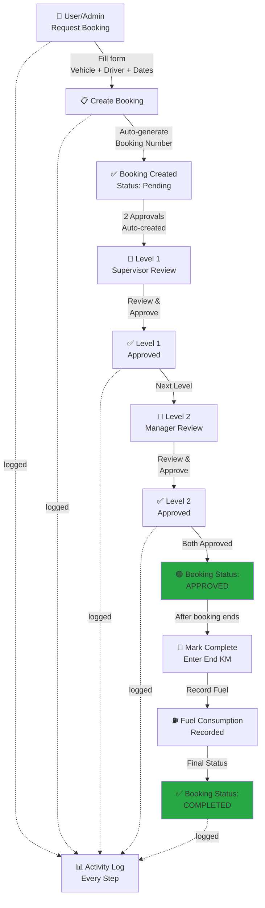
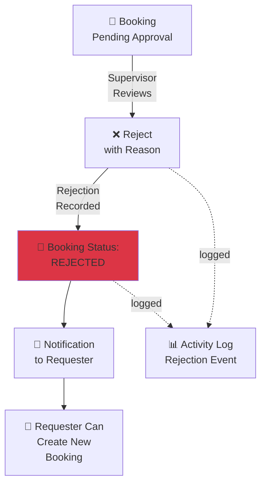
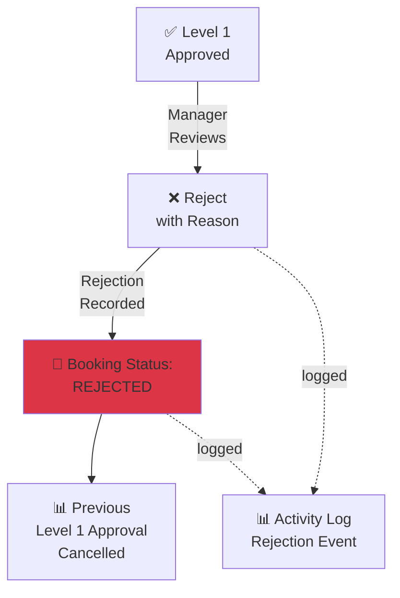
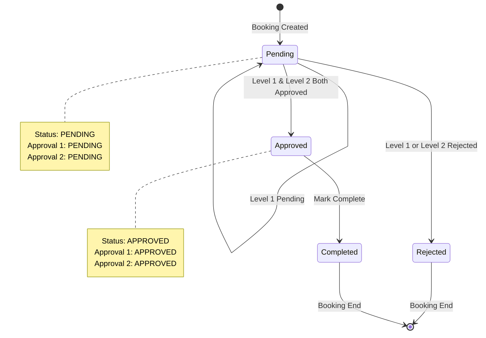
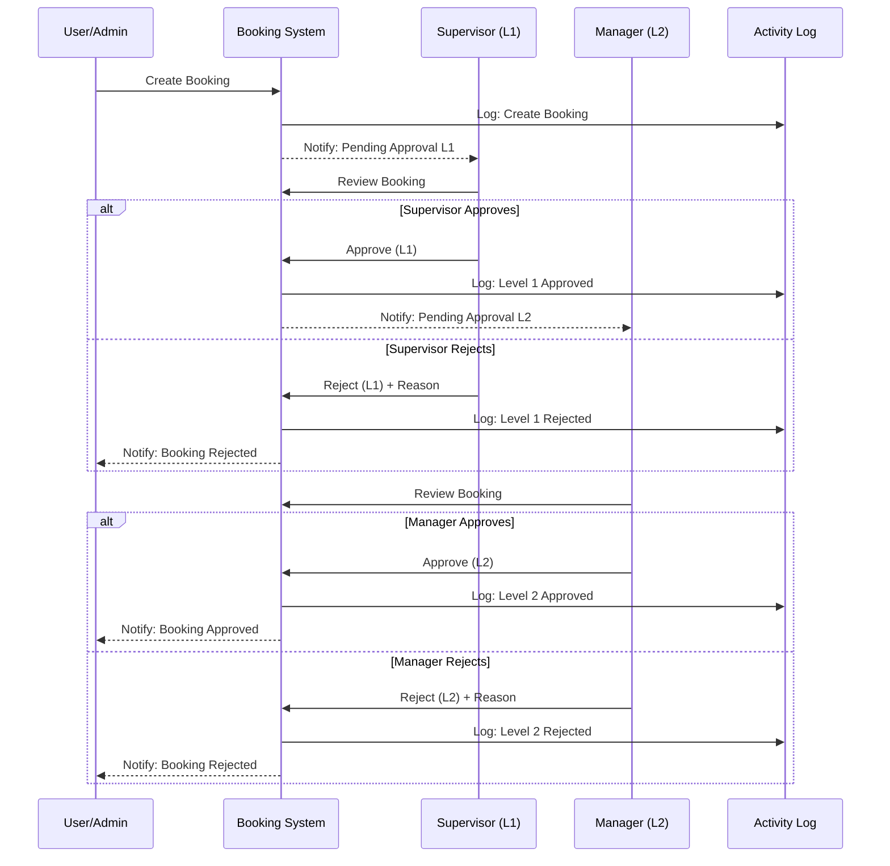

# 📊 Activity Diagram: Vehicle Booking Workflow

## 1. Complete Booking Workflow (Happy Path)



---

## 2. Rejection Flow (Level 1)



---

## 3. Rejection Flow (Level 2)



---

## 4. Approval State Machine



---

## 5. Actor Interaction Diagram



---

## 6. System State Transitions

| State | Condition | Next State | Notification |
|-------|-----------|-----------|--------------|
| **PENDING** | Created | Awaiting L1 | Supervisor notified |
| **PENDING** | L1 Approved | Awaiting L2 | Manager notified |
| **APPROVED** | Both approved | Active | Requester notified |
| **APPROVED** | Booking ended | Mark Complete | Requester can enter End KM |
| **COMPLETED** | End KM entered | Final | Booking archived |
| **REJECTED** | L1 rejects | Ended | Requester notified |
| **REJECTED** | L2 rejects | Ended | Requester notified |

---

## 7. Activity Logging Points

Every action logged:

```
✅ Booking Created
   → User ID, Booking Number, Vehicle, Driver
   
✅ Level 1 Approved/Rejected
   → Approver ID, Decision, Comments (if any)
   
✅ Level 2 Approved/Rejected
   → Approver ID, Decision, Comments (if any)
   
✅ Booking Completed
   → End KM, Fuel used, Duration
   
✅ Login/Logout
   → User, IP Address, Timestamp
```

---

## 8. User Hierarchy Visualization

```
        MANAGER (Level 2)
        └─ Supervisor (Level 1)
           ├─ User A
           ├─ User B
           └─ User C
```

**Approval Chain for User A:**
1. User A creates booking
2. **Supervisor** (User A's supervisor) approves L1
3. **Manager** (Supervisor's supervisor) approves L2
4. Booking → APPROVED

---

## Summary

This diagram shows:
- ✅ Happy path (create → approve L1 → approve L2 → complete)
- ✅ Rejection paths (L1 reject, L2 reject)
- ✅ State transitions
- ✅ Actor interactions
- ✅ Activity logging at each step
- ✅ Hierarchical approval structure
